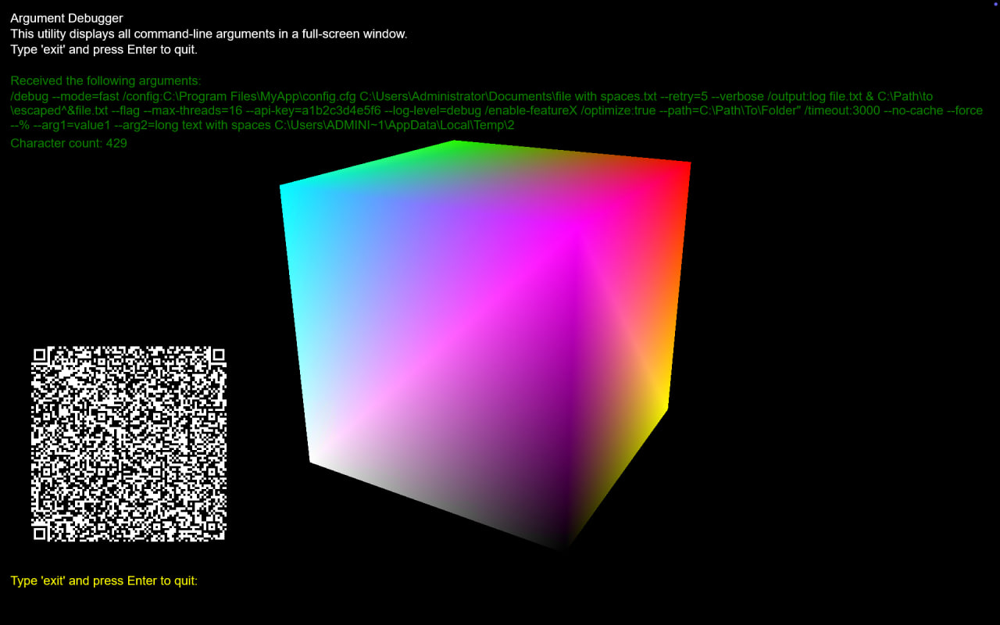

# Cloud Streaming Args Debugger

[](https://github.com/kryuchenko/cloud-streaming-args-debugger/actions/workflows/build.yml)

This is a Windows application designed for debugging command-line arguments in cloud streaming environments. It displays arguments in a full-screen window with a rotating 3D cube and a QR code that updates with the current timestamp, FPS, and the arguments passed. Perfect for troubleshooting cloud gaming and streaming application launches.

## What It Does

- **Displays Command-Line Arguments:** Shows any arguments you pass to the program.
- **3D Cube Animation:** Renders a rotating cube using Direct3D 11.
- **QR Code:** Generates and displays a QR code with the current UNIX time, FPS, and your arguments (updates every 5 seconds).
- **Keyboard Input:** Type into the window and if you type `exit` (or press Escape), the app will close.

## Screenshot

Check out a preview of the application:



## How to Build

1. **Requirements:**
   - **Visual Studio 2022:** Install the "Desktop development with C++" and "Universal Windows Platform development" workloads.
   - **Windows SDK:** Latest version is recommended.
   - **DirectX:** Use either the DirectX SDK (June 2010) or a modern Windows SDK.
   - **QrCodeGen Library:** Download `qrcodegen.hpp` and `qrcodegen.cpp` from [QrCodeGen by Nayuki](https://github.com/nayuki/QR-Code-generator) and place them in the same folder as the source file.
   - **vcpkg (for tests):** Optional, needed to install GoogleTest for running unit tests.

2. **Setup:**
   - Create a new C++ project in Visual Studio.
   - Add `cli_args_debugger.cpp`, `qrcodegen.hpp`, and `qrcodegen.cpp` to your project. (Note: The main source file retains its original name for compatibility)
   - Build the project (the code uses pragma directives to link the required DirectX libraries).

3. **Command Line Build:**
   
   Using MSBuild/Visual Studio:
   ```bash
   # Create build directory
   mkdir build

   # Compile with MSVC
   cl /EHsc /std:c++20 /permissive- /I. /DUNICODE /D_UNICODE ^
      cli_args_debugger.cpp seh_wrapper.cpp qrcodegen.cpp ^
      /Fe:build/ArgumentDebugger.exe ^
      /Fo:build/ ^
      /link d3d11.lib d3dcompiler.lib d2d1.lib dwrite.lib ole32.lib avrt.lib user32.lib shell32.lib gdi32.lib propsys.lib
   ```

4. **Build with CMake:**
   
   ```bash
   # Configure the build
   cmake -B build -S .

   # Build the project
   cmake --build build --config Release
   ```

5. **Build and Run Tests:**

   Using CMake with vcpkg:
   ```bash
   # Install GoogleTest via vcpkg
   vcpkg install gtest

   # Configure with vcpkg toolchain
   cmake -B build -S . -DCMAKE_TOOLCHAIN_FILE=<path_to_vcpkg>/scripts/buildsystems/vcpkg.cmake

   # Build
   cmake --build build --config Release

   # Run tests
   cd build
   ctest -C Release -V
   ```

## How to Run

- Run the compiled executable from a command prompt with any arguments you want:
  ```bat
  cloud-streaming-args-debugger.exe arg1 arg2 "another argument"
  ```

- Commands in the application:
  - Type `exit` or press Escape to quit
  - Type `save` to save timestamp and FPS data
  - Type `read` to load previously saved data
  - The audio level meter on the right shows microphone input